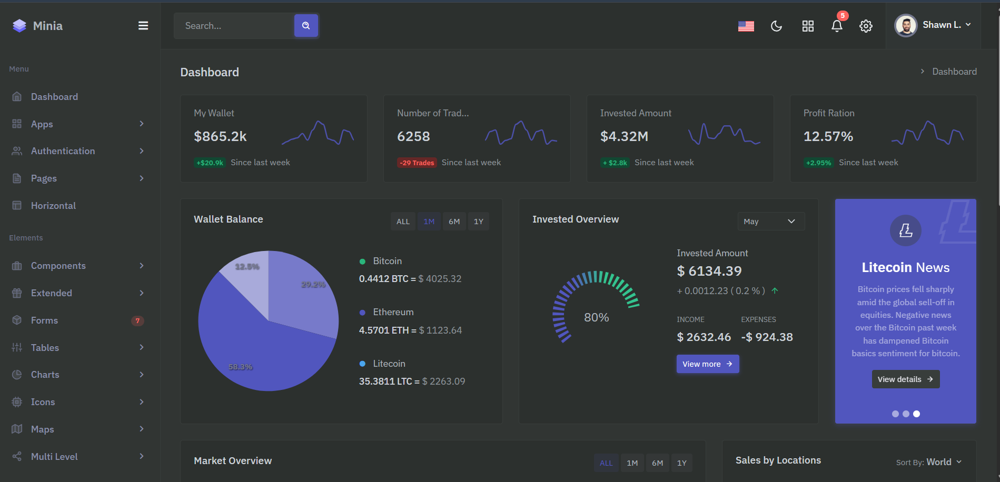

# Sistema de Usuários

### configurações inicias

- Organização
  - Front-end
  - Back-end

- Arquiterura
  
- linguagens usadas
  - docker 
  - php
  - codeigniter 4
  - javascript
  - html
  - css
  - bash
  - shell
  -   

---
- code
- sintaxe
- linguagens usadas
- como configurar
- como executar
- como clonar
- shell

---

### FOTOS
modelo de exemplo que sera usado
  

link: https://themesbrand.com/minia/layouts-lts/index-dark.html
---
