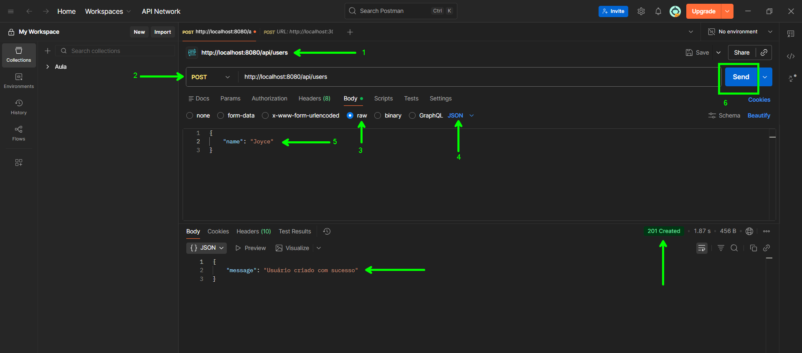
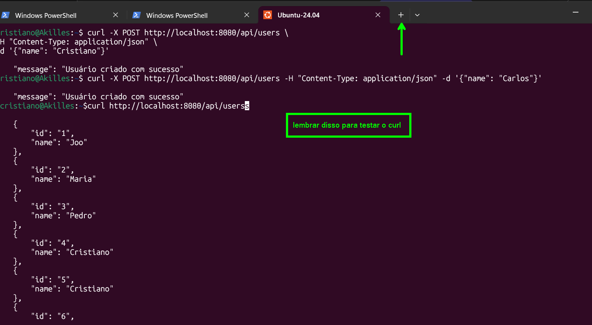

---
author: *Cristiano*

title: *CI4*

ano: 2026

---
# CI4
### Docker
- Inicie o docker desktop

```bash

PS C:\Users\brito> wsl --list --verbose
  NAME              STATE           VERSION
* Ubuntu-24.04      Running         2
  docker-desktop    Running         2
  kali-linux        Stopped         2
PS C:\Users\brito> wsl -d ubuntu-24.04
cristiano@Akilles:/mnt/c/Users/brito$ cd desktop
cristiano@Akilles:/mnt/c/Users/brito/desktop$ ls
cristiano@Akilles:/mnt/c/Users/brito/desktop$ cd Projetos/
cristiano@Akilles:/mnt/c/Users/brito/desktop/Projetos$ ls
sistema-usuarios-ci4
cristiano@Akilles:/mnt/c/Users/brito/desktop/Projetos$ cd sistema-usuarios-ci4/
cristiano@Akilles:/mnt/c/Users/brito/desktop/Projetos/sistema-usuarios-ci4$ ls
docker  docker-compose.yml  src  teste.txt
cristiano@Akilles:/mnt/c/Users/brito/desktop/Projetos/sistema-usuarios-ci4$ code .
cristiano@Akilles:/mnt/c/Users/brito/desktop/Projetos/sistema-usuarios-ci4$ docker compose up -d
cristiano@Akilles:/mnt/c/Users/brito/desktop/Projetos/sistema-usuarios-ci4$ docker ps
CONTAINER ID   IMAGE                      COMMAND                  CREATED         STATUS         PORTS                                     NAMES
264c5f74c7ad   httpd:2.4                  "sh -c ' sed -i 's/#…"   7 seconds ago   Up 5 seconds   0.0.0.0:8080->80/tcp, [::]:8080->80/tcp   ci4_web
802ef2ab9556   sistema-usuarios-ci4-app   "docker-php-entrypoi…"   8 seconds ago   Up 6 seconds   9000/tcp                                  ci4_app
cristiano@Akilles:/mnt/c/Users/brito/desktop/Projetos/sistema-usuarios-ci4$

```

---
### Indo nas urls para conferir se tudo esta correto
- acessar as rotas
- http://localhost:8080/ 
- http://localhost:8080/dashboard/nano
- http://localhost:8080/register
- http://localhost:8080/teste2/ana
- http://localhost:8080/teste/ana
- http://localhost:8080/login
- http://localhost:8080/users/3


*A algumas rotas que eu tinha ativas no momento*

---

## Criação de rotas controllers e metodos
- como criar uma rota?
    
  - src/app/Config/Routes.php

```php
$routes->get('/nova', 'NovaController::nova');
```


- como criar um controlador?
    
    - src/app/Controllers

src/app/Controllers/NovaController.php 

```php
<?php

namespace App\Controllers;

class NovaController extends BaseController
{
    public function nova(): string
    {
        return '<h2>ola rota Nova<h2>';
    }
}
```
- Ir na url:
    - http://localhost:8080/`nova`
    - `[nota]:` Na url usar o nome que criamos na rota `/nova`

- Como retornar uma view()
    - return view('`home`');
    - *colocamos o nome da view ou o caminho dentro da função*
    - ir na url: http://localhost:8080/`nova`
    - a view é um arquivo html normal salvo como .php

```php
<?php

namespace App\Controllers;

class NovaController extends BaseController
{
    public function nova(): string
    {
        return view('home');
    }
}
```
## Closures
- o que é uma closure?
    - é uma função anonima sem nome
```php
function() {
    return 'Olá';
}
```
- onde uso:
```php
$routes->get('/health', function(){
    return 'API ok! - codeigniter esta vivo! ola mundo!';
});
```
### fluxo:
- URL → Routes.php → Controller → View

---
### como passar dados para a view
- passando um array de dados
- nesse ex: `$data=[]`
```php
<?php
namespace App\Controllers;


class TesteController extends BaseController
{
    public function teste($name)
    {
        $data=[
            'nome' => $name
        ];
        return view('users/teste', $data);
    }
}

?>
```

### pegar os dados na view
- esc() é segurança → protege contra XSS
```php
<p><?php echo $nome ?></p>
<p><?= esc($nome) ?></p>
<p><?= $nome ?></p>
```
---

## MODEL
- criar um model

`src/app/Models/UserModel.php` inicial Mokado

```php
<?php

namespace App\Models;

use CodeIgniter\Model;

class UserModel extends Model
{
    public function getUsers()
    {
        return [
            ['id' => 1, 'name' => 'João'],
            ['id' => 2, 'name' => 'Maria'],
            ['id' => 3, 'name' => 'Pedro'],
        ];
    }

    public function getUserById($id)
    {
        foreach ($this->getUsers() as $user) {
            if ($user['id'] == $id) {
                return $user;
            }
        }

        return null;
    }
}
```
**UserModel para o banco de dados:**  `src/app/Models/UserModel.php`
```php
<?php
namespace App\Models;

use CodeIgniter\Model;

class UserModel extends Model
{
    protected $table = 'users';           // nome da tabela
    protected $primaryKey = 'id';         // primary key
    protected $allowedFields = ['name'];  // campo que pode ser preenchido(segurança)

    public function getUsers()
    {
        return [
            ['id' => 1, 'name' => 'João'],
            ['id' => 2, 'name' => 'Maria'],
            ['id' => 3, 'name' => 'Pedro'],
        ];
    }

    public function getUserById($id)
    {
        foreach ($this->getUsers() as $user) {
            if ($user['id'] == $id) {
                return $user;
            }
        }

        return null;
    }
}

```

- Instanciar o model

src/app/Controllers/Users.php

```php
<?php
namespace App\Controllers;

use App\Models\UserModel;

class Users extends BaseController
{
  public function index()
  {
     $model = new UserModel();

     $users = $model->getUsers();

     return view('users/index', [
        'users' => $users
     ]); 
  }

  public function show($id)
  {
     $model = new UserModel();

     $user = $model->getUserById($id);


     if(!$user){
       return 'Usuario não encontrado';
     }

      return view('users/show', [
        'user' => $user
      ]);
  }
}

?>
```
---

### CRIANDO O CONTROLADOR PARA O UserModel
`src/app/Controllers/UserController.php`
```php
<?php

namespace App\Controllers;

use App\Models\UserModel;                        // importa o model

class UserController extends BaseController
{
    public function index()
    {
        $userModel = new UserModel();            // instancia o model (cria ele na memoria)

        $users = $userModel->findAll();          // vai no banco buscar tudo

        return $this->response->setJSON($users); // retorna como api json
    }
}

```
### ROTAS:
```php
$routes->get('/users/(:num)', 'Users::show/$1');

$routes->get('/api/users', 'UserController::index');
```
### Depois de escrever o model ao tentar ir na url da erro

```php
CodeIgniter\Exceptions\CriticalError
The required PHP extension "mysqli" is not loaded. Install and enable it to use "MySQLi" driver. search →

SYSTEMPATH/Database/Database.php at line 182

175         if (extension_loaded($extension)) {
176             return true;
177         }
178 
179         $message = 'The required PHP extension "' . $extension . '" is not loaded.'
180             . ' Install and enable it to use "' . $driver . '" driver.';
181 
182         throw new CriticalError($message);
183     }
184 }
185 

```
### SOLUÇÃO 1:
- instalar o drive para o mysql no dockerfile

```php
FROM php:8.3-fpm

# Dependências do sistema
RUN apt-get update && apt-get install -y \
    git \
    unzip \
    libicu-dev \
    libzip-dev \
    libonig-dev \
    && docker-php-ext-install \
    intl \
    mbstring \
    pdo \
    pdo_mysql \
    mysqli \
    zip \
    opcache

# Composer
COPY --from=composer:2 /usr/bin/composer /usr/bin/composer

WORKDIR /var/www


```

### SOLUÇÃO 2:

Editar o arquivo:

- nano ~/.docker/config.json

- provavelmente vai ter algo assim:

```bash
{
  "credsStore": "desktop"
}

- Apaga essa linha ou deixa assim:

{}
```
#### como deixei

```bash

{
  "auths": {}
}
```
- Salva (CTRL + O, Enter, CTRL + X)

rebuildar para validar as correções:
- cristiano@Akilles:/mnt/c/Users/brito/desktop/Projetos/sistema-usuarios-ci4$ `docker compose up -d --build`

---

# Configurando o banco de dados e criando a conexão

docker-compose.yml
```php
  db:
    image: mysql:8
    container_name: ci4_db
    restart: always
    environment:
      MYSQL_ROOT_PASSWORD: root
      MYSQL_DATABASE: ci4
      MYSQL_USER: ci4user
      MYSQL_PASSWORD: ci4pass
    ports:
      - "3306:3306"
    volumes:
      - db_data:/var/lib/mysql
    networks:
      - ci4
```

nome do do serviço: `db`

src/app/Config/Database.php
```php
    public array $default = [
        'DSN'          => '',
        'hostname'     => 'db',
        'username'     => 'ci4user',
        'password'     => 'ci4pass',
        'database'     => 'ci4',
        'DBDriver'     => 'MySQLi',
        'DBPrefix'     => '',
        'pConnect'     => false,
        'DBDebug'      => true,
        'charset'      => 'utf8mb4',
        'DBCollat'     => 'utf8mb4_general_ci',
        'swapPre'      => '',
        'encrypt'      => false,
        'compress'     => false,
        'strictOn'     => false,
        'failover'     => [],
        'port'         => 3306,
        'numberNative' => false,
        'foundRows'    => false,
        'dateFormat'   => [
            'date'     => 'Y-m-d',
            'datetime' => 'Y-m-d H:i:s',
            'time'     => 'H:i:s',
        ],
    ];

```

*tirando a duvida dos nomes de containers*

```bash
cristiano@Akilles:/mnt/c/Users/brito/desktop/Projetos/sistema-usuarios-ci4$ docker ps                                                                      0.3s
CONTAINER ID   IMAGE                      COMMAND                  CREATED          STATUS          PORTS                                         NAMES    0.2s
227d2ebbb904   httpd:2.4                  "sh -c ' sed -i 's/#…"   11 seconds ago   Up 10 seconds   0.0.0.0:8080->80/tcp, [::]:8080->80/tcp       ci4_web
79fa4c6fdcde   sistema-usuarios-ci4-app   "docker-php-entrypoi…"   12 seconds ago   Up 10 seconds   9000/tcp                                      ci4_app
13752a2fd8df   mysql:8                    "docker-entrypoint.s…"   12 seconds ago   Up 10 seconds   0.0.0.0:3306->3306/tcp, [::]:3306->3306/tcp   ci4_db
```
---
### entrar no container do mysql

no terminal:
- `docker exec -it ci4_db mysql -u root -p`
- senha: `root`


```bash

PS C:\Users\brito> docker exec -it ci4_db mysql -u root -p
Enter password:root

mysql> show databases;

mysql> use ci4;

mysql> CREATE TABLE users (
    ->     id INT AUTO_INCREMENT PRIMARY KEY,
    ->     name VARCHAR(100)
    -> );

mysql> INSERT INTO users (name) VALUES ('Joo'), ('Maria'), ('Pedro');

mysql> show tables;

mysql> select * from users;
+----+-------+
| id | name  |
+----+-------+
|  1 | Joo   |
|  2 | Maria |
|  3 | Pedro |
+----+-------+
3 rows in set (0.00 sec)

mysql>
```
---


# CRUD
### create

- criando uma rota limpa

  - `$routes->post('/api/users', 'UserController::store');`

- ajustar o model
```php
<?php

namespace App\Models;

use CodeIgniter\Model;

class UserModel extends Model
{
    protected $table = 'users';           // passamos a tabela
    protected $primaryKey = 'id';         // primary key
    protected $allowedFields = ['name'];  // campo permitido
}
```
- criar o metodo
- `src/app/Controllers/UserController.php`

```php
<?php

namespace App\Controllers;

use App\Models\UserModel;                        // importa o model

class UserController extends BaseController
{
    public function index()
    {
        $userModel = new UserModel();            // instancia o model (cria ele na memoria)

        $users = $userModel->findAll();          // vai no banco buscar tudo

        return $this->response->setJSON($users); // retorna como api json
    }

    public function store()                      // metodo store armazenar usuario [2026-02-27 10:09]
    {
       $userModel = new UserModel();             // 1. cria uma nova instancia do modelo UserModel

       // 2. Pega o corpo da requisição esperando que venha em formato JSON
       //    O true como parâmetro faz o CodeIgniter converter o JSON em array associativo
       $data = $this->request->getJSON(true);    

       // 3. Verifica se o campo 'name' existe no JSON e se não está vazio
       if (!isset($data['name']) || empty($data['name'])) {
           // 4. Se não veio o nome ou veio vazio → retorna erro 400 (Bad Request)
           return $this->response->setJSON([
               'error' => 'Nome é obrigatório'
           ])->setStatusCode(400);
           // Obs: o return encerra a execução do método imediatamente
       }
       
       // 5. Se chegou aqui é porque tem nome → faz a inserção no banco de dados
       //    O método insert() do modelo geralmente faz INSERT INTO users ...
       $userModel->insert([
           'name' => $data['name']
           // Aqui poderiam vir mais campos, ex: 'email', 'password', etc.
       ]);

       // 6. Retorna resposta de sucesso com status 201 (Created)
       return $this->response->setJSON([
           'message' => 'Usuário criado com sucesso'
       ])->setStatusCode(201);
    }
}
```

- testando com postman


- para testar a requisição curls posso usar o terminal do ubuntu 
  - clicar no + e usar
```bash
cristiano@Akilles:~$ curl -X POST http://localhost:8080/api/users \
-H "Content-Type: application/json" \
-d '{"name": "Cristiano"}'
{
    "message": "Usuário criado com sucesso"
cristiano@Akilles:~$ curl -X POST http://localhost:8080/api/users -H "Content-Type: application/json" -d '{"name": "Carlos"}'
{
    "message": "Usuário criado com sucesso"
}cristiano@Akilles:~$
```

```bash

}cristiano@Akilles:~$curl http://localhost:8080/api/userss
[
    {
        "id": "1",
        "name": "Joo"
    },
    {
        "id": "2",
        "name": "Maria"
    },
    {
        "id": "3",
        "name": "Pedro"
    },
    {
        "id": "4",
        "name": "Cristiano"
    },
    {
        "id": "5",
        "name": "Cristiano"
    },
    {
        "id": "6",
        "name": "Joyce"
    },
    {
        "id": "7",
        "name": "Akilles"
    },
    {
        "id": "8",
        "name": "Cristiano"
    },
    {
        "id": "9",
        "name": "Carlos"
    }
]cristiano@Akilles:~$

```
- teste correto




---

## resolver pasta docs para nao ser rastreada

Como resolver isso (O "Pulo do Gato")
Para que o Git passe a respeitar o seu .gitignore e pare de listar a pasta devops, você precisa remover esses arquivos do índice (cache) do Git, sem apagá-los do seu computador.

Execute os seguintes comandos no seu terminal (dentro da pasta do projeto):

- Remover a pasta do cache do Git:

```Bash
git rm -r --cached devops/
(Isso diz ao Git: "Esqueça esses arquivos, mas não os delete do meu disco")
```
- Verificar o status:

```Bash
git status
Agora você verá que os arquivos da pasta devops aparecerão como "deleted" (no índice) e a pasta não deve mais aparecer em "modified".
```
Confirmar a mudança:

```Bash
git add .
git commit -m "Removendo pasta devops do rastreamento para respeitar o gitignore"
```