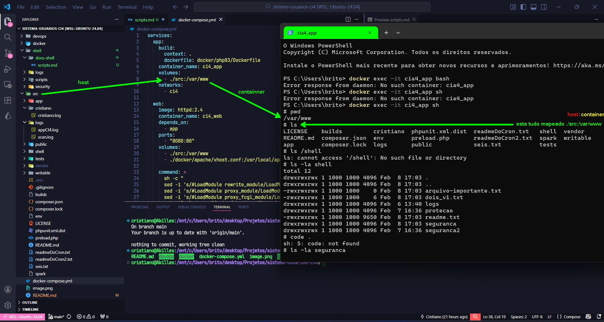
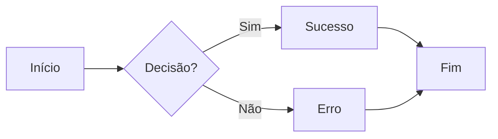

# SCRIPTS SHELL

- rodar o docker desktop
- no terminal
- PS C:\Users\brito> **wsl --list --verbose**
- PS C:\Users\brito> **wsl -d ubutnu-24.04**
- cristiano@Akilles:/mnt/c/Users/brito$ **cd desktop**
- cristiano@Akilles:/mnt/c/Users/brito/desktop$ **ls**
- cristiano@Akilles:/mnt/c/Users/brito/desktop/Projetos$ **cd sistema-usuarios-ci4/**
- cristiano@Akilles:/mnt/c/Users/brito/desktop/Projetos/sistema-usuarios-ci4$ **code .**
- cristiano@Akilles:/mnt/c/Users/brito/desktop/Projetos/sistema-usuarios-ci4$ **docker compose up -d**  
- ver se tudo subiu:
```bash
cristiano@Akilles:/mnt/c/Users/brito/desktop/Projetos/sistema-usuarios-ci4$ docker ps
CONTAINER ID   IMAGE                      COMMAND                  CREATED          STATUS          PORTS                                         NAMES
dc75d7619cf8   httpd:2.4                  "sh -c ' sed -i 's/#…"   45 seconds ago   Up 43 seconds   0.0.0.0:8080->80/tcp, [::]:8080->80/tcp       ci4_web
887ca551aa6c   sistema-usuarios-ci4-app   "docker-php-entrypoi…"   45 seconds ago   Up 44 seconds   9000/tcp                                      ci4_app
61468b0f12ae   mysql:8                    "docker-entrypoint.s…"   45 seconds ago   Up 44 seconds   0.0.0.0:3306->3306/tcp, [::]:3306->3306/tcp   ci4_db
```
---
- em outro terminal:
    - PS C:\Users\brito> docker exec -it ci4_app sh
    - pwd
    - ls
    - ls -la shell


#### onde as pastas estão


entrando no container e listando
```bash
PS C:\Users\brito> docker exec -it ci4_app sh
# pwd
/var/www
# ls
LICENSE    builds         cristiano  phpunit.xml.dist  readmeDoCron.txt   shell  vendor
README.md  composer.json  env        preload.php       readmeDoCron2.txt  spark  writable
app        composer.lock  logs       public            seis.txt           tests
```
- Olhar o docker-compose.yml para ver para onde as pastas estão sendo mapeadas
   
|HOST|:|CONTAINER|
|:---|:-:|:--------|
|`/src`|:|`/var/www`|   

```bash
volumes:
  - ./src:/var/www
```
---
### como resolver o problema das setas quando nao funciona o terminal
- PS C:\Users\brito> docker exec -it ci4_app bash
- PS C:\Users\brito> docker exec -it ci4_app sh
    - Usando sh o terminal não aceita usar as setas para cima para baixo etc... para resolver so entrar usando bash

---
### dentro do container instalar o vim
- apt install -y vim
- vim pegarEntradaUsuario-00.sh
```bash
root@887ca551aa6c:/var/www/shell/seguranca# cat pegarEntradaUsuario-00.sh
#!/bin/bash
echo 'teste de permissao'
```
- root@887ca551aa6c:/var/www/shell/seguranca# chmod +x pegarEntradaUsuario-00.sh
- root@887ca551aa6c:/var/www/shell/seguranca# ls -l
- -rwxrwxrw`x` 1 1000 1000    39 Feb 28 12:48 pegarEntradaUsuario-00.sh
- root@887ca551aa6c:/var/www/shell/seguranca# `./pegarEntradaUsuario-00.sh`

#### script que pega a entrada do usuario

- root@887ca551aa6c:/var/www/shell/seguranca# cat pegarEntradaUsuario-00.sh
```bash
#!/bin/bash
echo 'teste de permissao'
echo "digite seu nome: "
read NOME
echo "bem vindo! $NOME"
```
---
### script que verifica se uma pasta e um arquivo existe
root@887ca551aa6c:/var/www/shell/seguranca# `cat decisaoVerificacao-01.sh`
```bash
#!/bin/bash
##############################################
# esse escript verifica se uma pasta existe
# cria a pasta se ela nao existir
# verifica se um arquivo existe
# mostra mensagens claras de status
##############################################
echo "INICIO DO SCRIPT"
PASTA="/var/www/shell/logs"
ARQUI="$PASTA/verificaPastaArquivo.log"

if [ -d "$PASTA" ]; then
  echo "pasta $PASTA ja existe."
else
        echo "pasta nao existe criando. . ."
        mkdir $PASTA
fi

if [ -f "$ARQUI" ]; then
        echo "arquivo existe."
else
        echo "arquivo nao existe criando..."
        touch $ARQUI
fi

echo "status final"
ls -l $PASTA
echo "=====[ FIM ]====="
```
**adicionando cor ao script**

root@887ca551aa6c:/var/www/shell/seguranca# `cat decisaoVerificacao-01.sh`
```bash
#!/bin/bash
##############################################
# esse escript verifica se uma pasta existe
# cria a pasta se ela nao existir
# verifica se um arquivo existe
# mostra mensagens claras de status
##############################################
echo "INICIO DO SCRIPT"

#############################################
VERDE='\033[0;32m'
AMARELO='\033[1;33m'
VERMELHO='\033[0;31m'
AZUL='\033[0;34m'
AZUL_CLARO='\033[1;34'
RESET='\033[0m'
#############################################

PASTA="/var/www/shell/logs"
ARQUI="$PASTA/verificaPastaArquivo.log"

if [ -d "$PASTA" ]; then
        echo -e "pasta${VERDE}\t[ $PASTA ]\t\t\t\t\t${RESET}ja existe."
else
        echo "pasta nao existe criando. . ."
        mkdir $PASTA
fi

if [ -f "$ARQUI" ]; then
        echo -e "arquivo${AZUL}\t[ $ARQUI ]\t${RESET}ja existe."
else
        echo "arquivo nao existe criando..."
        touch $ARQUI
fi

echo "status final"
ls -l $PASTA
echo "=====[ FIM ]====="
```
saida:

root@887ca551aa6c:/var/www/shell/seguranca# `./decisaoVerificacao-01.sh`
```bash
INICIO DO SCRIPT
pasta   [ /var/www/shell/logs ]                                 ja existe.
arquivo [ /var/www/shell/logs/verificaPastaArquivo.log ]        ja existe.
status final
total 4
-rwxrwxrwx 1 1000 1000 882 Feb  6 13:40 scan_extesoes.log
-rwxrwxrwx 1 1000 1000   0 Feb 28 13:55 verificaPastaArquivo.log
=====[ FIM ]=====
```
---
procura por pastas e arquivos

root@887ca551aa6c:/var/www/shell/seguranca# cat percorrePastaAnalizaArquivos-02.sh
```bash
#!/bin/bash
##################################
# script que percorre uma pasta
# analiza arquivos
# mostra informacoes
##################################
VERDE='\033[0;32m'
AMARELO='\033[1;33m'
RESET='\033[0m'
echo '----- [ varredura de arquivos ] -----'
PASTA='/var/www/shell'

for ITEM in $PASTA/*
do
        if [ -d "$ITEM" ]; then
                echo -e "${VERDE}[PASTA  ]${RESET}\t $ITEM"
        elif [ -f "$ITEM" ]; then
                echo -e "${AMARELO}[ARQUIVO]${RESET}\t $ITEM"
        fi
done
date
echo '----- [ FIM DO SCRIPT ] -----'
root@887ca551aa6c:/var/www/shell/seguranca#
```


root@887ca551aa6c:/var/www/shell/seguranca# `./percorrePastaAnalizaArquivos-02.sh`

saida:
```bash
----- [ varredura de arquivos ] -----
[ARQUIVO]        /var/www/shell/arquivo-importante.txt
[ARQUIVO]        /var/www/shell/dois_v1.txt
[PASTA  ]        /var/www/shell/logs
[PASTA  ]        /var/www/shell/protecao
[ARQUIVO]        /var/www/shell/readme.txt
[PASTA  ]        /var/www/shell/seguranca
[PASTA  ]        /var/www/shell/seguranca2
Sat Feb 28 14:51:31 UTC 2026
----- [ FIM DO SCRIPT ] -----
```
---
## git
cristiano@Akilles:/mnt/c/Users/brito/desktop/Projetos/`sistema-usuarios-ci4`$ 
- git status
- git add .
- git commit -m "mudando o size do link do readme"
- git push -u origin main
- git status

---


## GRAFICOS E SETAS EM MARKDOWN



Resultado (quando o lugar suporta Mermaid):
- precisa instalar a extesão markdown preview mermaid support e salvar como html e abrir no google chrome só depois ctrl + p para imprimir e salvar como pdf ai vemos os graficos
  
---

